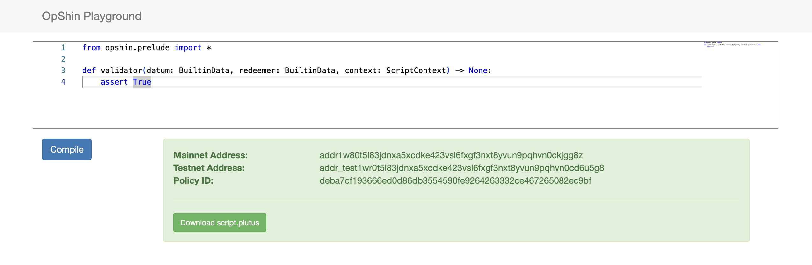

# OpShin Playground



This is OpShin Playground, a simple web application designed for exploring [OpShin](https://github.com/OpShin), a python-based Cardano Smart Contract language. This project serves as an interactive environment where users can experiment with OpShin code without the need for a local setup.

The idea for creating an OpShin Playground website was originally raised in [OpShin GitHub issue #346](https://github.com/OpShin/opshin/issues/346).

## Features

- **Syntax Highlighting:** Powered by Monaco Editor, providing a familiar coding environment.
- **Build and Lint:** Compile OpShin contracts server-side, with linting and artifact outputs.
- **User Interface:** Clear feedback on build success or failure, including linting errors.
- **Future Enhancements:** Wallet integration for contract deployment.

## Setup Instructions

### Supported Versions

The following versions of `python` and `npm` are supported/recommended:
- **Python:** 3.9.x and 3.10.x
- **npm:** 10.x.x and 9.x.x
Please ensure you are using one of these supported versions to avoid compatibility issues.

### Server Setup

1. Set up a virtual environment and install required packages:
   ```
   cd server
   python3 -m venv .venv
   source .venv/bin/activate
   pip install -r requirements.txt
   ```

2. Run the server using uvicorn:
   ```
   uvicorn server:app --reload --port 8000
   ```

### Frontend Setup

1. Install dependencies:
   ```
   npm install
   ```

2. Open `index.html` in your browser.
